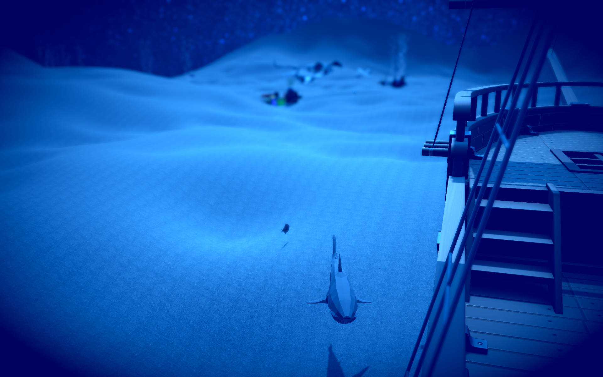

# Sunken Secrets: The Treasure Of The Three Keys



## Overview

This repository contains the code for an immersive underwater game I made using C#, Unity, and maya. Here is the synopsis: ```Explore the mysterious and dangerous underwater world of the Bermuda Triangle! You are a diver who has been hired by a mysterious radio operator to find three keys that will unlock a sunken treasure chest that holds untold treasures and a priceless red crystal. Along the way, you will encounter various vibrant rock and coral environments, a variety of exotic and colourful fish, and the hidden and roaming blood-thirsty sharks that will try to devour you. You will also discover the sunken planes and relics that hint at the long history and mystery of the Bermuda Triangle. You will have to use your swimming skills and your wits to navigate the perilous depths and find the 3 keys and the chest. What secret lies within the chest? What is the true purpose of your mission? Who is the radio operator and what is his agenda? Find out in Sunken Secrets: The Treasure Of The Three Keys, a game that will challenge your curiosity and courage.```

## Features

- **Spawning Enemies**: Enemies spawn at random locations and move towards the player.
- **Giant Final Boss**: A challenging final boss appears at the end of the game.
- **Dynamic Music**: The music changes dynamically based on the game state.
- **Power Ups**: Players can collect various power-ups to enhance their spaceship.

<br>
